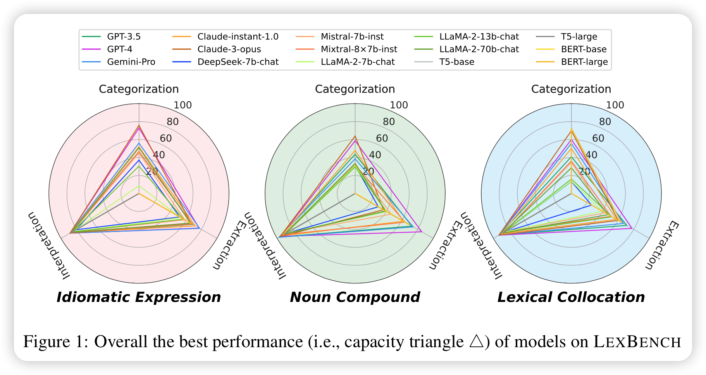

# LexBench

The repository of the research project ``Revisiting a Pain in the Neck: Semantic Phrase Processing Benchmark for Language Models''.



## Supporting Task
LexBench now supports the tasks shown as below.
| Task                                   |  Abbr. | Eval Metrics            | Phrase Type   | Support Models | Status |
|----------------------------------------|--------|-------------------------|---------------|----------------|--------|
| Idiomatic Expression Detection         | IED    | Accuracy                | Idiomacity    | GPT, BERT      | ✅      |
| Idiomatic Expression Extraction        | IEE    | Sequence-level Accuracy | Idiomacity    | GPT, BERT      | ✅      |
| Idiomatic Expression Interpretation    | IEI    | Rouge-L, BertScore-F1   | Idiomacity    | GPT, T5        | ✅      |
| Noun Compound Compositionality         | NCC    | Accuracy                | Noun Compound | GPT, BERT      | ✅      |
| Noun Compound Extraction               | NCE    | Sequence-level Accuracy | Noun Compound | GPT, BERT      | ✅      |
| Noun Compound Interpretation           | NCI    | Rouge-L, BertScore-F1   | Noun Compound | GPT, T5        | ✅      |
| Lexical Collocation Categorization     | LCC    | Accuracy                | Collocation   | GPT, BERT      | ✅      |
| Lexical Collocation Extraction         | LCE    | Sequence-level Accuracy | Collocation   | GPT, BERT      | ✅      |
| Lexical Collocation Interpretation     | LCI    | Rouge-L, BertScore-F1   | Collocation   | GPT, T5        | ✅      |
| Verbal Multiword Expression Extraction | VMWE   | Sequence-level Accuracy | Verbal MWE    | GPT, BERT      | ✅      |

## Preparing Data
```bash
unzip resources/dataset.zip -d lexbench/
```

## Preparing Environments
```bash
conda env create -f environment.yml

cd lexbench
pip install -r requirements.txt
```

## Running Evaluation on Specific Task 
For example, the command for running idiom interpretation with `Claude-3-opus` is shown below.

```bash
# make sure the current directory is "LexBench/lexbench"

python main.py \
  --task idiom-paraphrase \
  --api_key <Your API key> \
  --model claude-3-opus-20240229 \
  --prompt_path prompts/idiom_paraphrase_zeroshot.txt \
  --example_path dataset/idiom_paraphrase/prepared/examples.tsv \
  --input_path dataset/idiom_paraphrase/prepared/idiom_paraphrase_prepared.tsv \
  --output_path results/idiom-paraphrase_0-shot_claude-3-opus-20240229.json \
  --evaluate \
  --shot_num 0 \
  --max_query 1000 \
  --max_tokens 128 \
  --temperature 0 \
  --presence_penalty 0 \
  --frequency_penalty 0
```

## Benchmarking Scaling-category Semantic Categorization

```bash
./run_lcc_scaling.sh
```
